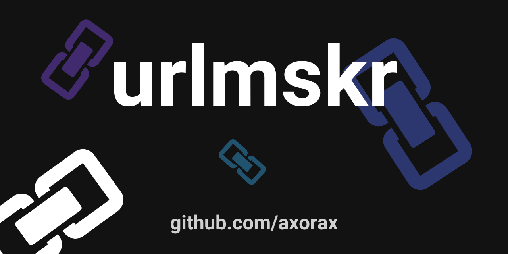

<h1 align="center">urlmskr</h1>
<p align="center">Easy and free to use URL masker with an even easier API</p>
<br>



### **Example:**

Input:

```
https://www.patreon.com/axorax
```

Output:

```
https://axorax.github.io/urlmskr/aHR0cHM6Ly93d3cucGF0cmVvbi5jb20vYXhvcmF4
```

Or, you can also use:

```
https://axorax.github.io/urlmskr/?r=aHR0cHM6Ly93d3cucGF0cmVvbi5jb20vYXhvcmF4
```

You can also make it into a masked text by using:

```
https://axorax.github.io/urlmskr/?t=aHR0cHM6Ly93d3cucGF0cmVvbi5jb20vYXhvcmF4
```

# urlmskr API
API URL: https://urlmskr.axorax.repl.co/

Add parameter `r` with value to get a redirect masked link.

**API Example:**
```sh
https://urlmskr.axorax.repl.co/?r=https://www.patreon.com/axorax
```
**JSON Response:**
```json
{
  "url": "https://axorax.github.io/urlmskr/aHR0cHM6Ly93d3cucGF0cmVvbi5jb20vYXhvcmF4",
  "query": "https://www.patreon.com/axorax",
  "id": "aHR0cHM6Ly93d3cucGF0cmVvbi5jb20vYXhvcmF4",
  "mode": "redirect",
  "success": true
}
```

### Change mode (optional)

Add parameter `mode` with the value set to the mode you want to use.

**Example**
```sh
https://urlmskr.axorax.repl.co/?r=https://www.patreon.com/axorax&mode=text
```

**JSON Response:**
```json
{
   "url":"https://axorax.github.io/urlmskr/?t=aHR0cHM6Ly93d3cucGF0cmVvbi5jb20vYXhvcmF4",
   "query":"https://www.patreon.com/axorax",
   "id":"aHR0cHM6Ly93d3cucGF0cmVvbi5jb20vYXhvcmF4",
   "mode":"text",
   "success":true
}
```

The default mode is redirect.

Available Modes:
* redirect
* text

---

[Support me on Patreon](https://www.patreon.com/axorax) - [Connect with me](https://github.com/axorax/socials)
